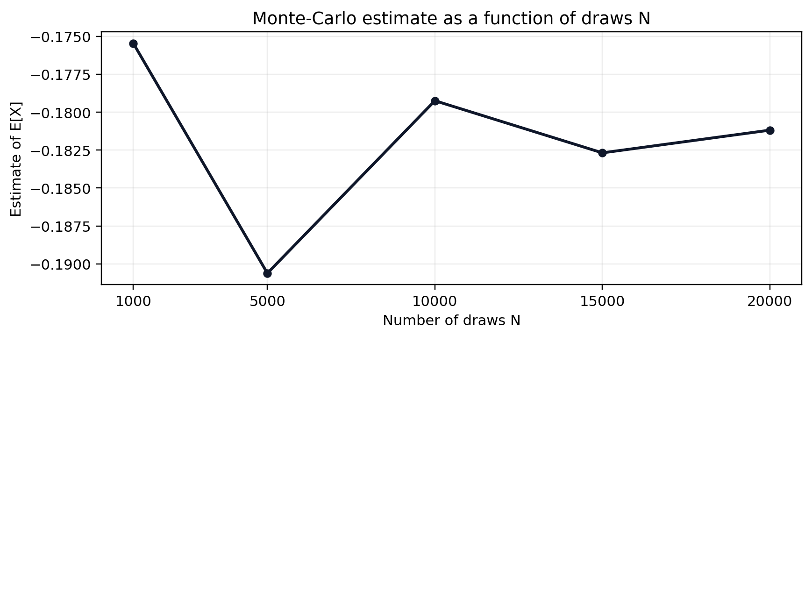
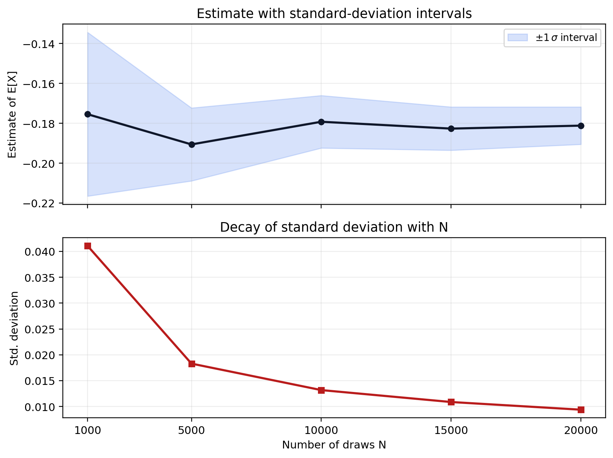
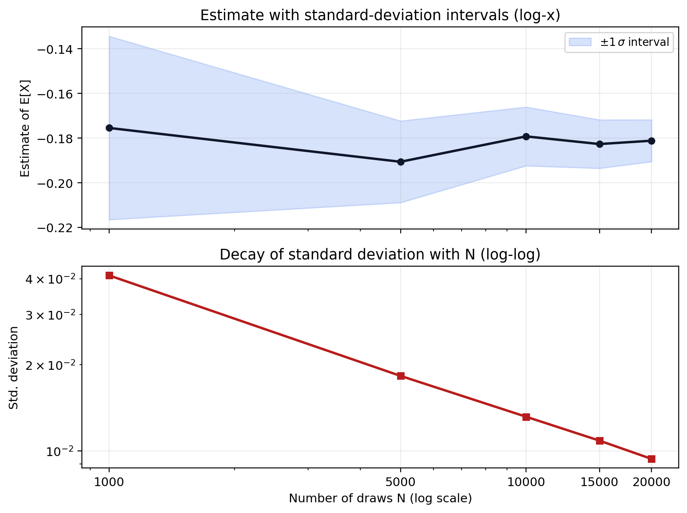
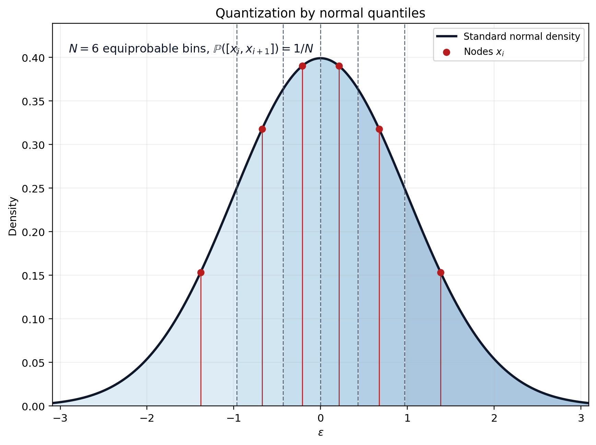
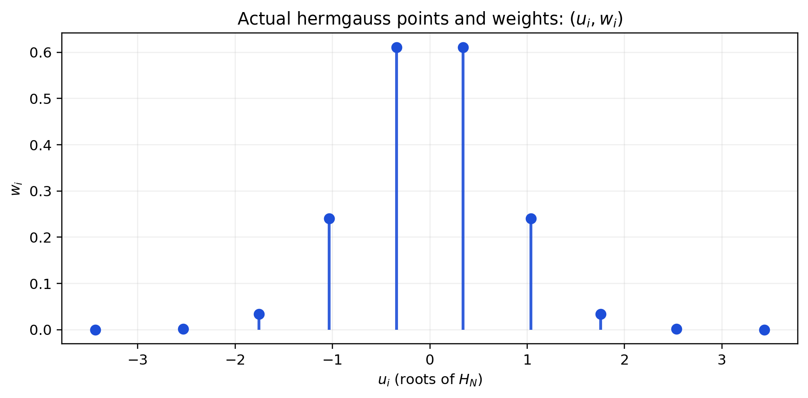

# Introduction

## Several kinds of Discretization


- approximate operator with a finite number of iterations:
    - compute $\int_a^b f(x) dx$
    - compute $E_\omega f(\omega)$
- represent an infinite dimensional object with a finite set of parameters:
    - $f \equiv (f(x_i))_{i=1:N}$ with $x_i=a+\frac{i-1}{N-1}(b-a)$
      - discretize arguments
    - $\omega \equiv (\mu_i, \omega_i)_{i=1:N}$ such that $E_\omega f(\omega) \approx \sum_i \mu_i f(\omega_i)$ (quantization)
- discretize continous process by a discrete one:
  - continuous markov chain to discrete markov Chain


# Discretizing an iid law


## Common problem:

Given $f$, and an iid process $\epsilon \sim N(0,\sigma^2)$, how to approximate
 $E_{\epsilon} f(\epsilon)$ ?

. . .

Some Ideas:

::: {.incremental}
- draw *lots* of random $(\epsilon_n)_{n=1:N}$ and compute $$\frac{1}{N}\sum_{n=1}^N f(\epsilon_n)$$
    - aka Monte-Carlo simulations
- given a method to approximate integrals, define  $\mu(u)=\frac{1}{\sigma\sqrt{2 \pi}}e^{-\frac{u^2}{2\sigma^2}}$ and compute $$\int_{u=-\infty}^{\infty} f(u) \mu(u) du$$ 
- *discretize* (or *quantize*) the signal $\epsilon$ as 
$(w_i, \epsilon_i)_{i=1:N}$ and compute:
$$\frac{1}{N} \sum_n w_n f(\epsilon_n)$$ 
:::

## What's wrong with Monte-Carlo Simulations?


::: columns

:::: column

Define $X(\epsilon) = U(C(\epsilon))$ where $U(c)=\frac{c^{1-\gamma}}{1-\gamma}$ and $C(\epsilon) = e^{\epsilon}$. We want to compute $E_{\epsilon} X(\epsilon)$ precisely.

How many draws do we need ?

::::: {.r-stack}

:::::: {.fragment fragment-index=3 .current-visible}

{fig-alt="Monte Carlo estimate of E[X] versus number of draws in a 2x1 layout with empty second panel." width=74%}

::::::
:::::: {.fragment fragment-index=4 .current-visible}

{fig-alt="Monte Carlo estimate with plus/minus one standard deviation intervals and standard deviation decay versus number of draws in a 2x1 layout." width=74%}

::::::
:::::: {.fragment fragment-index=5}

{fig-alt="Monte Carlo estimate with plus/minus one standard deviation intervals and standard deviation decay versus number of draws in a 2x1 layout with logarithmic x-axis." width=74%}

::::::
:::::

:::::: {.fragment fragment-index=6 .current-visible}

The decrease in standard deviations is too slow.

::::::

::::

:::: column


::::: {.r-stack}

:::::: {.fragment fragment-index=3 .current-visible}

Define the Model in Julia

```julia
# imports:
using Distributions: Normal

# define the model
σ = 0.05; γ = 40
C(e) = exp(e)
U(x)=(x^(-γ))/(-γ)
X(e) = U(C(e))

# create distributions
dis = Normal(0,σ)      
E_ϵ(f;N=1000) = sum(f(rand(dis)) for i=1:N)/N

NVec = [1000, 5000, 10000, 15000, 20000]
```

Monte-Carlo estimates for various N:

```julia
julia> vals = [E_ϵ(X; N=i) for i=NVec]
5-element Array{Float64,1}:
 -0.17546927855215824
 -0.1906119630309043
 -0.17924501776041424
 -0.1826805612086024
 -0.181184208323609
``` 
::::::

:::::: {.fragment fragment-index=4}

Monte-Carlo estimates of the variance for various N:


```julia
using Statistics: std

#computes estimates for various N
stdev(f; N=100, K=100) = std(E_ϵ(f; N=N) for k=1:K)
```

```julia
julia> @time sdvals = [stdev(C; N=n, K=10000) for n=NVec]      
 99.558940 seconds (2.55 G allocations: 38.011 GiB, 0.81% gc time)
5-element Array{Float64,1}:                                       
 0.04106466473642666                                              
 0.018296399941889575                                             
 0.013174287295527257                                             
 0.01086721462174894                                              
 0.009383218078206898 
```
::::::

:::::
::::
:::


## What's wrong with Monte-Carlo Simulations?


## Quick theory (1)


Suppose we want to compute $\mathbb{E}[\epsilon]$ where $\epsilon \sim \mathcal{N}(0,\sigma_{\epsilon}^2)$ by averaging $N$ independent draws $\epsilon_n$ of $\epsilon$.

Define $$T_N =\frac{1}{N}\sum_{n=1}^N \epsilon_n$$

. . . 

The mean  of $T_N$ is 0 (it's an unbiased estimator).  

Let's compute its variance:
$$\mathbb{E}(T_N^2) = \frac{1}{N^2} \sum_{n=1}^N \mathbb{E}\left[ \epsilon_n^2 \right] = \frac{1}{N}\sigma_{\epsilon}^2$$

And the standard deviation:
$$s_N = \sigma(T_N^2) = \frac{1}{\sqrt{\color{red} N}} \sigma_{\epsilon}$$

. . .

__Conclusion__: the precision of Monte-Carlo estimates decrease as a square root of the number of experiments.


## Quick theory (2)

In the general case, we want to estimate $\mathbb{E}[f(\epsilon)]$  the Monte-Carlo estimator is:
$$T^{MC}_N =\frac{1}{N}\sum_{n=1}^N f(\epsilon_n)$$

It is *unbiased*:
$$E(T_N^{MC}) = E\left[f(\epsilon) \right]$$

It's *variance* is 

$$E(T_N^{MC}) \propto \frac{1}{\sqrt{N}}$$

__Concusion__:

- still decreases as a square root of N: *slow*
- big advantage: rate independent of the dimension of $\epsilon$


## Quantization using quantiles

::: columns

:::: column

*Equiprobable* discretization

- Works for any distribution with pdf $\mu$ and cdf $\mu$

Split the space into $N$  equiprobable quantiles:
  $$(I_i=[a_i,a_{i+1}])_{i=1:N}$$ such that $\mathbb{P}(\epsilon \in I_i)=\frac{1}{N}$

This yields: $a_1=-\infty, a_{N+1}=\infty, a_i = \xi^{-1}\left(\frac{i-1}{N}\right)$


Choose the *nodes* as the median of each interval: $$\mathbb{P}(\epsilon\in[a_i,x_i]) = \mathbb{P}(\epsilon\in[x_i,a_{i+1}])$$
This yields: $\boxed{x_i = \xi^{-1}\left(\frac{i-0.5}{N}\right)}$

The quantization is simply $(w_i, x_i)_{i=1:N}$ with $w_i = 1/N$.

::::

:::: column

{fig-alt="Equiprobable quantization of a normal distribution using quantile bins and median nodes." width=96%}

::::

:::


<!-- ### Quadrature rule

Idea:
- $f\in \mathcal{F}$ a Banach space
  - $I: f\rightarrow E_{\epsilon} f(\epsilon)$ is a linear application
- suppose there is a dense family of polynomials $P_n$, spanning $\mathcal{F}_n$
  - $I$ restricted to $\mathcal{F}_N$ is a $N$-dimensional linear form
- take $N$ points $(a_n)_{n\in[1,N]}$. The set $\{f\rightarrow\sum_{n=1}^N w_n f(a_n) | w_1, ... w_N\}$ is a vectorial space.
  - one element matches exactly $\left.I\right|_{\mathcal{F}}$
- so the quadrature rule $(w_n, a_n)$ is exactly accurate for polynomials of order $n<N$.
  - how to choose the points $a_n$?

--- -->

## Gauss-Hermite

Suppose $f\in \mathcal{F}$ a Banach space of functions with scalar values., $\epsilon$ a normal gaussian variable (stdev 1). 

Define $I(f) = E_{\epsilon} f(\epsilon)$.

Take a family of polynomials $P_n$ orthogonal with respect to the weight function $\mu(u) = e^{-u^2}$, i.e. such that $$\int_{-\infty}^{\infty} P_n(u) P_m(u) \mu(u) du = 0$$ for $n\neq m$.  Suppose these polynomials (hermite polynomials) are dense in $\mathcal{F}$ (they can approximate any function in $\mathcal{F}$ with arbitrary precision).

. . . 

::: {.r-stack}

:::: {.fragment .current-visible}

__Intuition from linear algebra__: $I$ restricted to $\mathcal{F}_{N-1}$ is a linear form with $N$ degrees of freedom. Given any $N$ points $(\epsilon_n)_{n=1:N}$, we can thus find $N$ weights $(w_n)_{n=1:N}$ such that $$\left.\left(f\rightarrow\sum_{n=1}^N w_n f(\epsilon_n) \right)\right|_{\mathcal{F}_{N-1}}= \left.I\right|_{\mathcal{F}_{N-1}}$$

- We have formula that is exact for polynomials of order $N-1$ or less
- Will work well if $f$ can be approximated by polynomials

::::

:::: {.fragment}

__Gauss quadrature__ magic (with real nodes and positive weights): there is a unique way to choose $\epsilon_n$__and__ $w_n$ such that $$\left.\left(f\rightarrow\sum_{n=1}^N w_n f(\epsilon_n) \right)\right|_{\mathcal{F}_{2N-1}}= \left.I\right|_{\mathcal{F}_{2N-1}}$$

- for $\epsilon_n$: the roots of the $N$-th hermite polynomial
- we need the values of $f$ at $N$ points: the formula is exact if $f$ is a polynomial of order $2N-1$ or less!

::::

:::

## Gauss-Hermite

- Very accurate if a function can be approximated by polynomials
- Bad:
  - imprecise if function $f$ has kinks or non local behaviour
    - points $\epsilon_n$ can be very far from the origin (see below)
  - not super easy to compute weights and nodes (but there are good libraries)

{fig-alt="Gauss-Hermite nodes and effective weights over a standard normal density, showing nodes far in the tails." width=74%}


## Gauss-*

Same logic can be applied to compute integration with weight function $w(x)$: 

$$\int_a^b f(x) w(x)$$

Use polynomials orthogonal with respect to $w$:

- Gauss-Hermite:
  - $w(x) = e^{-x^2}$, $[a,b] = [-\infty, \infty]$
  - to compute expectations with respect to normal distribution

- Gauss-Legendre:
  - $w(x) = 1$
  - to compute integrals without weight on a bounded interval

- Gauss-Chebychev:
  - $w(x)=\sqrt{1-x^2}$,  $[a,b] = [-1, 1]$
  - for periodic functions


## In practice

Beware that gauss-hermite weight are given for the normalized gaussian+ law:

$$\frac{1}{\sqrt{2 \pi \sigma^2}}\int f(x) e^{-\frac{x^2}{2\sigma^2}}dx = {\frac{1}{\sqrt{\pi}}}\int f(u {\sigma \sqrt{2}}) e^{-{u^2}}du $$


Compute 

$$\mathbb{E}_{\epsilon}[f(\epsilon)]  \approx {\frac{1}{\sqrt{\pi}}}\sum_n w_n f(\epsilon_n {\sigma \sqrt{2}})$$


```julia
using FastGaussQuadrature

x, w = gausshermite( 10 );
x = x.*σ*sqrt(2) # renormalize nodes
s = sum( w_*X(exp(x_)) for (w_,x_) in zip(w,x))
s /= sqrt(\pi) # renormalize output
```


# Discretizing an AR1

## Discretizing an AR1

- Take $AR1$ process $$x_t = \rho x_{t-1} + \epsilon_t$$
    - with $|\rho| <1$ and $\epsilon \sim N(0,\sigma)$
- Can we replace $(x_t)$ by a discrete markov chain?
    - with finite number of states $N$ and transition matrix $\P$ of size $N\times N$.
    - approximate version:
      - good time $x^g$ and bad time $x^b$. Probability $\pi$ of staying in the same, $1-\pi$ of switching.
    - two systematic methods (available in *QuantEcon.jl*)
        - Tauchen
        - Rouwenhorst

## AR1: Tauchen


__Reminder__:  The unconditional distribution of an AR1 is a normal law $\mathcal{N}(0,\frac{\sigma}{\sqrt{1-\rho^2}})$

__Algorithm__:

- Choose $m>0$, typically $m=3$
- Bound the process: $\underline{x} = -m \frac{\sigma}{\sqrt{1-\rho^2}}$ and $\overline{x} = m \frac{\sigma}{\sqrt{1-\rho^2}}$
- Define the $N$ discretized points ($i\in[1,n]$): $y_i = \underline{x} + \frac{i-1}{N-1}(\overline{x}-\underline{x})$
- Define the transitions:

$$\begin{eqnarray}
\pi_{ij} & = & \mathbb{P} \left( y_{t+1}=y_j|y_t=y_i\right)\\
         & = & \mathbb{P} \left( |y_{t+1}-y_j| = \inf_k |y_{t+1}-y_k| \left| y_t=y_i \right. \right)
\end{eqnarray}$$


## AR1: Tauchen (2)

- Formulas $\delta=\frac{\overline{x}-\underline{x}}{N-1}$, $F$ the cdf of $\mathcal{N}(0,\sigma^2)$, and $\pi_{ij}$ the transition matrix:

  - if $1<j<N$

    $$\pi_{ij} = F\left(\frac{y_j + \delta/2-\rho y_i}{\sigma_{\epsilon}}\right) - F\left(\frac{y_j - \delta/2-\rho y_i}{\sigma_{\epsilon}}\right)$$

  - if $j=1$

    $$\pi_{i1} = F\left(\frac{y_1 + \delta/2-\rho y_i}{\sigma_{\epsilon}}\right)$$

  - if $j=N$

    $$\pi_{iN} = 1- F\left(\frac{y_N - \delta/2-\rho y_i}{\sigma_{\epsilon}}\right)$$


## How to assess the quality of approximation ?

- compare generated stationary moments between discretized process and true AR1:
  - E(), Var(), ACor()

- by looking at the exact ergodic distribution or by doing some simulations

- not very precise when then process is very persistent $\rho\approx 1$


## Rouvenhorst method (1)

- N = 2
  - choose $y_1=-\psi$, $y_2=\psi$
  - define transition matrix:
$$\Theta_2 = \begin{bmatrix}
p & 1-p\\\\
1-q & q
\end{bmatrix}$$
  - choose $p$, $q$ and $\psi$ to match some moments: $E()$, $Var()$, $ACor()$
    - they can be computed analytically for AR1 and for discretized version.


## Rouvenhorst method (2)

- N >2
$$\Theta_N =
p \begin{bmatrix}  
\Theta_{N-1}  & 0\\\\
0 & 0
\end{bmatrix} +
(1-p) \begin{bmatrix}  
0 & \Theta_{N-1} \\\\
0 & 0
\end{bmatrix} +
(1-q) \begin{bmatrix}  
0 & 0\\\\
\Theta_{N-1} & 0
\end{bmatrix} +
q \begin{bmatrix}  
0 & 0\\\\
0 & \Theta_{N-1}
\end{bmatrix}
$$
- Normalize all lines


## Rouvenhorst method (3)

- Procedure converges to Bernouilli distribution.

- Moments can be computed in closed form:

    - $E() = \frac{(q-p)\psi}{2-(p+q)}$
    - $Var() = \psi^2 \left[ 1-4 s (1-s) + \frac{4s(1-s)}{N-1}\right]$
    - $Acor()= p+q-1$

- Rouwenhorst method performs better for highly correlated processes

